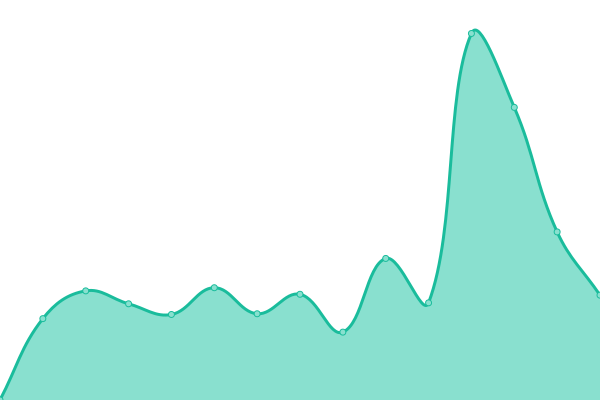

# [📈 Live Status](https://demo.upptime.js.org): <!--live status--> **🟩 All systems operational**

This repository contains the open-source uptime monitor and status page for [Upptime](https://upptime.js.org), powered by [Upptime](https://github.com/upptime/upptime).

With [Upptime](https://upptime.js.org), you can get your own unlimited and free uptime monitor and status page, powered entirely by a GitHub repository. We use [Issues](https://github.com/upptime/upptime/issues) as incident reports, [Actions](https://github.com/xskip/upptime/actions) as uptime monitors, and [Pages](https://demo.upptime.js.org) for the status page.

<!--start: status pages-->
<!-- This summary is generated by Upptime (https://github.com/upptime/upptime) -->
<!-- Do not edit this manually, your changes will be overwritten -->
<!-- prettier-ignore -->
| URL | Status | History | Response Time | Uptime |
| --- | ------ | ------- | ------------- | ------ |
|  Mario Urbancic | 🟩 Up | [mario-urbancic.yml](https://github.com/xSkip/upptime/commits/HEAD/history/mario-urbancic.yml) | 

 1153ms
     
 | 

<a href="https://upptime.mariosite.at/history/mario-urbancic">100.00%</a>
    

|  Qigong im Marchfeld | 🟩 Up | [qigong-im-marchfeld.yml](https://github.com/xSkip/upptime/commits/HEAD/history/qigong-im-marchfeld.yml) | 

 2057ms
     
 | 

<a href="https://upptime.mariosite.at/history/qigong-im-marchfeld">100.00%</a>
    

|  Kamptal | 🟩 Up | [kamptal.yml](https://github.com/xSkip/upptime/commits/HEAD/history/kamptal.yml) | 

 641ms
     
 | 

<a href="https://upptime.mariosite.at/history/kamptal">100.00%</a>
    

|  Ausbildungsstall | 🟩 Up | [ausbildungsstall.yml](https://github.com/xSkip/upptime/commits/HEAD/history/ausbildungsstall.yml) | 

 3918ms
     
 | 

<a href="https://upptime.mariosite.at/history/ausbildungsstall">100.00%</a>
    

|  Deine Zeit | 🟩 Up | [deine-zeit.yml](https://github.com/xSkip/upptime/commits/HEAD/history/deine-zeit.yml) | 

 1777ms
     
 | 

<a href="https://upptime.mariosite.at/history/deine-zeit">100.00%</a>
    

|  MSVO | 🟩 Up | [msvo.yml](https://github.com/xSkip/upptime/commits/HEAD/history/msvo.yml) | 

 2053ms
     
 | 

<a href="https://upptime.mariosite.at/history/msvo">100.00%</a>
    

|  Foersternaehrung | 🟩 Up | [foersternaehrung.yml](https://github.com/xSkip/upptime/commits/HEAD/history/foersternaehrung.yml) | 

 1649ms
     
 | 

<a href="https://upptime.mariosite.at/history/foersternaehrung">100.00%</a>
    

|  FCG GPA | 🟩 Up | [fcg-gpa.yml](https://github.com/xSkip/upptime/commits/HEAD/history/fcg-gpa.yml) | 

 3533ms
     
 | 

<a href="https://upptime.mariosite.at/history/fcg-gpa">100.00%</a>
    

|  FCG GPA Entwicklung | 🟩 Up | [fcg-gpa-entwicklung.yml](https://github.com/xSkip/upptime/commits/HEAD/history/fcg-gpa-entwicklung.yml) | 

 576ms
     
 | 

<a href="https://upptime.mariosite.at/history/fcg-gpa-entwicklung">100.00%</a>
    

<!--end: status pages-->

[**Visit our status website →**](https://demo.upptime.js.org)

## 📄 License

- Powered by: [Upptime](https://github.com/upptime/upptime)
- Code: [MIT](./LICENSE) © [Upptime](https://upptime.js.org)
- Data in the `./history` directory: [Open Database License](https://opendatacommons.org/licenses/odbl/1-0/)
